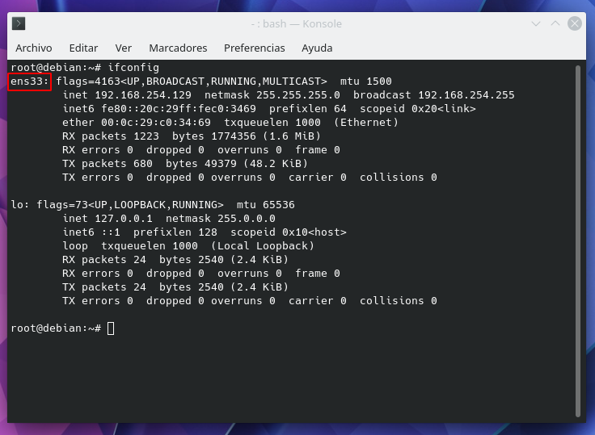
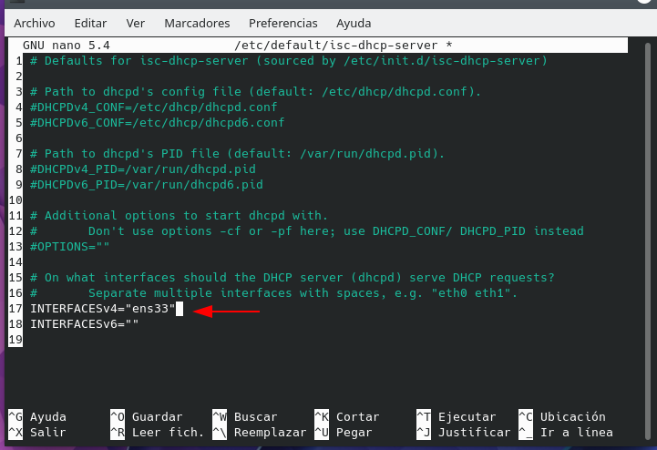

## Configuración de Repositorios

```bash
# Repo-base
deb http://deb.debian.org/debian bullseye main contrib non-free
deb-src http://deb.debian.org/debian bullseye main contrib non-free

# bullseye-updates
deb http://deb.debian.org/debian bullseye-updates main contrib non-free
deb-src http://deb.debian.org/debian bullseye-updates main contrib non-free

# debian-security
deb http://deb.debian.org/debian-security/ bullseye-security main contrib non-free
deb-src http://deb.debian.org/debian-security/ bullseye-security main contrib non-free

# backports
deb http://deb.debian.org/debian bullseye-backports main contrib non-free
deb-src http://deb.debian.org/debian bullseye-backports main contrib non-free
```
Actualizar los repositorios del sistema:

```bash
su -
```
```bash
apt update
```

### Flameshot
Programa para sacar y editar screenshots

```bash
apt install flameshot
```
### Oh-My-Posh
Para estilizar la linea de comandos

**Instalar HomeBrew**

```bash
sudo apt install build-essential procps curl file git -y
```

```bash
/bin/bash -c "$(curl -fsSL https://raw.githubusercontent.com/Homebrew/install/HEAD/install.sh)"
```

```bash
eval "$(/home/cox/.linuxbrew/bin/brew shellenv)"
```
Si todo funciona bien 

```bash
brew doctor
```
Revisar la version
```bash
brew --version
```

**Oh-My-Posh**

```bash
brew install jandedobbeleer/oh-my-posh/oh-my-posh
```


## DHCP
paqute requerido a instalar

```bash
apt install isc-dhcp-server
```
para verificar su estado de instalacion
```bash
dpkg -s isc-dhcp-server
```
**Ver las interfaces disponibles**

```bash
ifconfig
```
o tambien:

```bash
ls /sys/class/net
```



* ens33 = Es la interfaz la cual escucha las solicitudes DHCP

**Configuración de interfaz**

Se debe configurar la interface

```bash
nano -l /etc/network/interfaces
```

En este archivo se crea la interface

```bash
# interface conf
auto ens33
iface ens33 inet static
    address 10.33.1.2
    netmask 255.255.255.0
    gateway 10.33.1.1
```

Reinniciar el servicio networking

```bash
/etc/init.d/networking restart
```

Establecer la tarjeta de red sra la que "repartirá" las direcciones IP.
Abrir el archivo de configuración

```bash
nano -l /etc/default/isc-dhcp-server
```
En la linea 17 poner ens33



**Configurar el Scope (Ambito de distribución)

Abrir el archivo de configurarción del servidor de DHCP

```bash
nano -l /etc/dhcp/dhcpd.conf
```
En este archivo es donde se puede configurar todas las caracteristicas del servidor DHCP

Ejemplo:

```bash
option domain-name "servercox.org";
option domain-name-servers 8.8.8.8, 8.8.4.4;
```

```bash
subnet 10.33.1.0 netmask 255.255.255.0 {
   range 10.33.1.100 10.33.1.200;
   option routers 10.33.1.1;
}
```
Ahora reiniciar el servidor DHCP

```bash
# 1ra forma
/etc/init.d/isc-dhcp-server restart

# 2da forma
service isc-dhcp-server restart

#3ra forma
systemctl restart isc-dhcp-server
```
Ver el estado:

```bash
# 1ra forma
/etc/init.d/isc-dhcp-server status

# 2da forma
service isc-dhcp-server status

#3ra forma
systemctl status isc-dhcp-server
```


